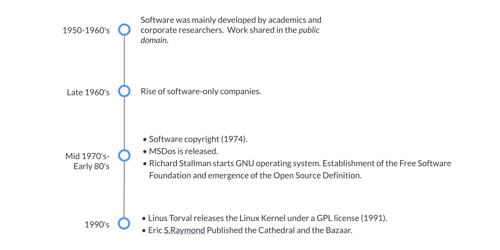

# Module 01: Introduction To Open Source

- [Module 01: Introduction To Open Source](#module-01-introduction-to-open-source)
  - [Overview 🧭](#overview-)
  - [Learning Objectives 🧠](#learning-objectives-)
  - [The Origins Of Open Source 🌱](#the-origins-of-open-source-)
  - [Pragmatism vs. Social Movement ✊🏾](#pragmatism-vs-social-movement-)
    - [The Four Freedoms](#the-four-freedoms)
    - [Open Source Definition](#open-source-definition)
  - [Resources 📚](#resources-)

## Overview 🧭

## Learning Objectives 🧠

By the end of this section, you should be able to:

* Define open source and describe the main pillars of open source software.

## The Origins Of Open Source 🌱

Sharing software began almost as the computer age emerged the practice of sharing software was often the norm in the early days of Computer Science.

The image below shows a condensed timeline of the Origins of open source.

* In the early years of computing (1950-1960s) software was often a research activity and was often released under the public domain, meaning that these works could not be owned by an individual or a collective.
* Later, in the 1960s, with the rise of compilers and Operating Systems (OS) also came the rise of software-only companies.
* In 1974 software was granted the ability to be copyrighted, which marks the start of software as a commodity.
* In the Early 1980s, the Free Software Foundation (FSF) was founded by Richard Stallman, which was the first organization to advocate for free software. Within that decade Stallman also wrote the [Free Software Definition][free-software-definition].
* Around this same time, the GNU Public License (GPL), was created and the first Linux kernel was released under such license.
* In the 1998s, the term open source was coined by a group of industry and free software individuals and the Open Source Initiative (OSI) was founded.

## Pragmatism vs. Social Movement ✊🏾

> Open Source is a development methodology; free software is a social movement
> `-`*Richard Stallman*

### The Four Freedoms

The Free Software Foundation is the organization responsible for defending the **Four Freedoms**. These freedoms establish the requisites for a piece of software to be considered free software.

* **Freedom 0**: The freedom to run the program as you wish, for any purpose.
* **Freedom 1**: The freedom to study how the program works, and change it, so it does your computing as you wish. Access to the source code is a precondition for this.
* **Freedom 2**: The freedom to redistribute copies, so you can help others.
* **Freedom 3**: The freedom to distribute copies of your modified versions to others. By doing this you can give the whole community a chance to benefit from your changes. Access to the source code is a precondition for this.

However, the word *free* in Free Software has often been conflated with *free, as in no price tag included*.

> **Note:**
> *Free software* does not mean *noncommercial*. On the contrary, a free program must be available for commercial use, commercial development, and commercial distribution.

### Open Source Definition

The Open Source Initiative (OSI) is the organization responsible for defending the [**Open Source Definition** (OSD)][OS-definition]. The OSD is built on the Four Freedoms and the [Debian Software Guidelines](https://www.debian.org/social_contract#guidelines). It is formed by a set of 10 requirements that a piece of software must meet in order to be considered open source and is accepted as the single canonical definition of open source:

1. Free Redistribution
2. Source Code
3. Derived works
4. Integrity of the author's source code
5. No discrimination against persons or groups
6. No discrimination against fields of endeavor
7. Distribution of license
8. License must not be specific to a product
9. License must not restrict other software
10. License must be technology-neutral

> **Note:**
> This definition of open source was coined in an attempt to clarify the concept of free from the [Four Freedoms](#the-four-freedoms), leading to a more pragmatic approach of software development (vs. the social movement approach of free software).

In the OSD the considerations are more technically aligned with a focus on faster and better development involving the community. As a consequence, the Open Source movement has seen more corporate buy-in and adoption.

## Resources 📚

* [The Free Software Definition][free-software-definition]
* [The Cathedral and the Bazaar][cathedral-and-bazaar]

<!-- reusable links -->
[free-software-definition]: https://www.gnu.org/philosophy/free-sw.en.html#four-freedoms
[cathedral-and-bazaar]: https://creatingaction.stanford.edu/pdf/cathedral-bazaar.pdf
[OS-definition]: https://opensource.org/osd-annotated