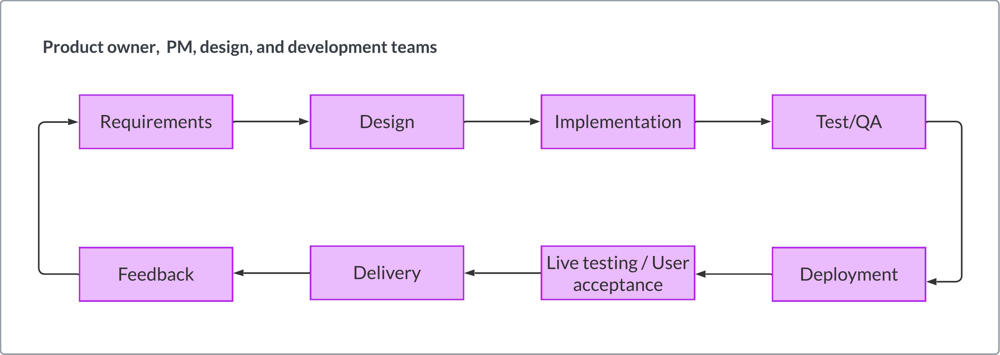

| Learner personas | - [code contributor](../README.md#code-contributor-)  - [code-adjacent contributor](../README.md#code-adjacent-contributor-)                                                                                                                                                |
| ---------------- | ------------------------------------------------------------------------------------------------------------------------------------------------------------------------------------------------------------------------------------------------------------------------------ |
| Pre-requisites   | - [Module 01: Introduction to Open Source](../01-intro-to-os/)  - [Chapter 2.1: Why and how to contribute to Open Source](./01-why-contributing-to-oss.md)  - [Chapter 2.2: Understand Open Source Sustainability and Life Cycle](./02-understand-oss-sustainability.md) |

# Chapter 03: Contributing to open source

## Table of Contents 🗂️

- [Chapter 03: Contributing to open source](#chapter-03-contributing-to-open-source)
  - [Table of Contents 🗂️](#table-of-contents-️)
  - [Learning Objectives 🧠](#learning-objectives-)
  - [Contribution tips and best practices 🔖](#contribution-tips-and-best-practices-)
    - [How contributions work 🎁](#how-contributions-work-)
    - [Contributions beyond code ✨](#contributions-beyond-code-)
  - [Development and maintenance considerations 💻](#development-and-maintenance-considerations-)
  - [Legal and governance considerations ⚖️](#legal-and-governance-considerations-️)
  - [Tools 🛠](#tools-)
  - [Resources 📚](#resources-)
  - [Continue learning 🚥](#continue-learning-)

## Learning Objectives 🧠

<!-- TODO: update as content is added -->

- Learn more about how to best approach open source contributions
- Learn about valuable tools and practices for open source contributions and project management

## Contribution tips and best practices 🔖

### How contributions work 🎁

For any open source project, one of the most challenging tasks for a new contributor is identifying ways to get involved by making online contributions to propose appropriate changes. Contribution processes vary depending on the open source project, its governance model, and the type of contribution you want to make. For example:

- Projects have different guidelines covering coding style, documentation style, testing, release, versioning, Pull/Merge Requests, issues, triaging, and more.
- Some projects require all contributors to sign contributor license agreements (CLAs), while others have signed-off-by or other processes.
- Some projects have a defined team of core developers or maintainers. In contrast, others follow a federated model or are organized via Working Groups/Special Interest Groups responsible for different project areas.

These are only a few ways that the contribution style might differ, so it is paramount that you familiarize yourself with the project's contribution guidelines and processes before you start contributing.

> **Note**
> We will cover community guidelines in more detail in the next chapter.

In general, an open source project allows any individual to make contributions in the form of [issues](https://help.github.com/en/github/managing-your-work-on-github/about-issues) or [Pull Requests](https://help.github.com/en/github/collaborating-with-issues-and-pull-requests/about-pull-requests)(called Merge Requests in GitLab). Community members can also perform [reviews](https://help.github.com/en/github/collaborating-with-issues-and-pull-requests/about-pull-request-reviews) and provide feedback or suggestions through [comments](https://help.github.com/en/github/collaborating-with-issues-and-pull-requests/commenting-on-a-pull-request) on the ideas and changes which they or others have suggested. This exchange of ideas leads to a better quality of resources that are developed collaboratively and bring new perspectives regarding a particular feature.

The diagram below shows a typical workflow for code contributions to an open source project. While many projects follow this workflow, others might have additional steps or different ways of handling contributions.

 Start -> identify if there is an issue or create one -> assign issue -> make and push changes -> open PR and wait for review -> address feedback cycles -> ending contribution in merge or reject and close" width="500px">

> **Note**
> As you can see, the outcome of a contribution could be getting your contribution merged or rejected.

It is important to remember that the outcome of a contribution is not a reflection of your skills or abilities. It reflects the project's needs and priorities at that time. There are loads of factors that need to be considered by a sustainer when reviewing and approving contributions: maintainability, security, performance, scalability, upstream and downstream compatibility, and more.

### Contributions beyond code ✨

Not all contributions to an open source project will be made in the form of code.
Open source projects also need contributions in documentation, design, marketing, community management, fundraising, legal counsel, accessibility auditing and remediation work, translation and localization, and more. These contributions are as significant as code contributions and are often called code-adjacent contributions.

While some of these contributions _might_ follow a similar workflow to code contributions, others might not. For example, a contribution to the documentation of a project might follow the Pull Request workflow described above. However, community-related contributions such as organizing community meetings or mentoring new contributors follow different processes.

As discussed in [Chapter 02](./02-understand-oss-sustainability.md), a project's sustainability requires collective actions across multiple areas; thus including and acknowledging all types of contributions is paramount for the success of an open source project. This starts with creating no-code/code-adjacent contribution pathways to adopt mechanisms to make these contributions visible and valued.

> **Tip**
> GitHub only makes certain types of contributions visible, while many other vital contributions are obscured or not accounted for.
> You can consider adding the [all contributors bot][all-contributors] to your projects to ensure everyone gets credit for their contributions.

👉🏽 The Turing Way has a [dedicated section on their contribution guidelines for recognizing contributions using the "all contributors" bot][turing-contributions].

## Development and maintenance considerations 💻

Let's start by revising a popular product-focused software development lifecycle: the Agile lifecycle.

Agile has gained tremendous popularity as it enables development teams to iterate on and ship new products and features efficiently and with consistent throughput.
However, these practices are best suited for traditional tech corporate (including startup and similar) scenarios, mainly due to the following reasons:

- Such a process assumes a dedicated team of developers (and designers) working on the project.
- It requires a product owner and a project manager to coordinate the work an.

## Legal and governance considerations ⚖️

## Tools 🛠

- [All contributors bot][all-contributors]

## Resources 📚

## Continue learning 🚥

⬅️ **[Previous Chapter: 02 Understand Open Source Sustainability and Life Cycle](./02-understand-oss-sustainability.md)** | **[Next Chapter: 04 Being a Good OS Citizen as a corporate sponsor](./04-good-corporate-oss-citizen.md)** ➡

<!-- Reusable links -->

[all-contributors]: https://allcontributors.org/docs/en/bot/overview
[turing-contributions]: https://github.com/alan-turing-institute/the-turing-way/blob/main/CONTRIBUTING.md#recognising-contributions
